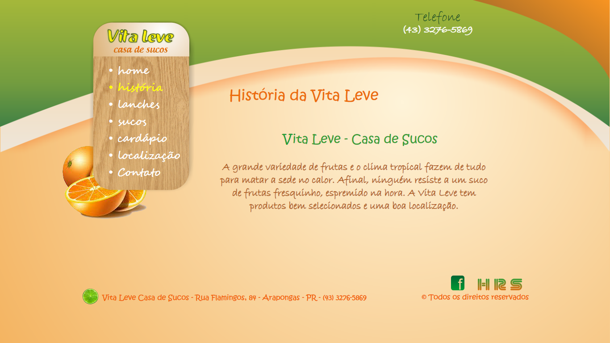
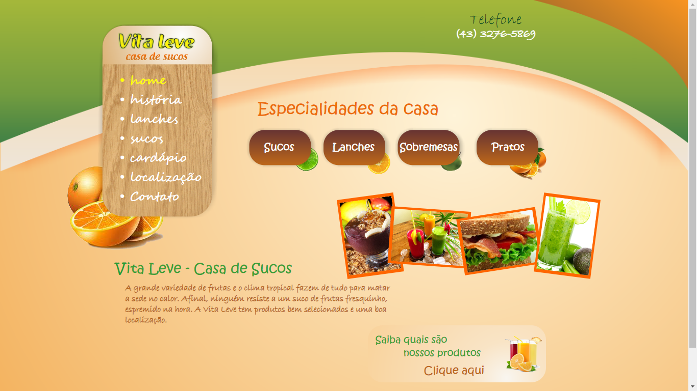
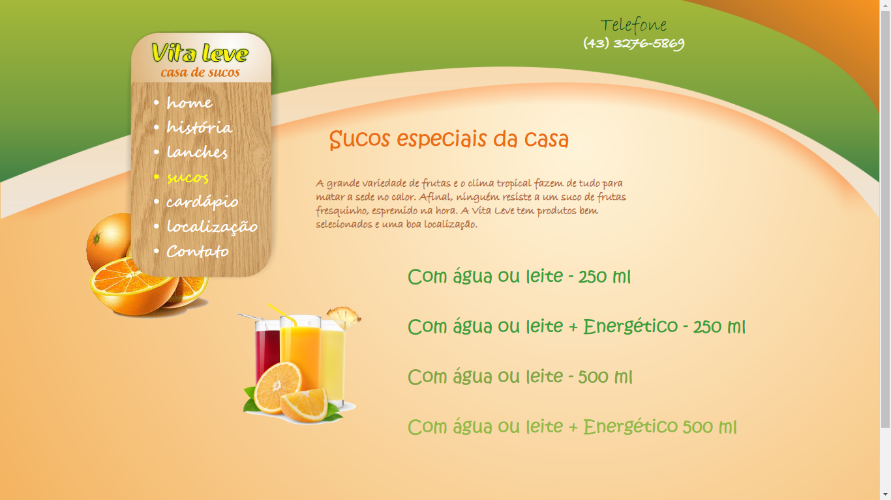
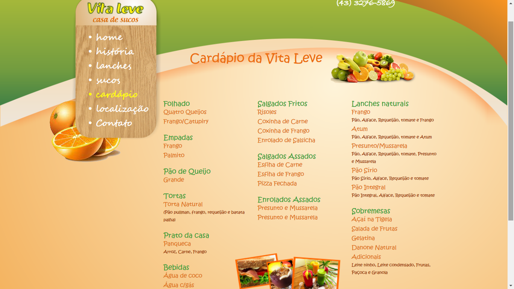
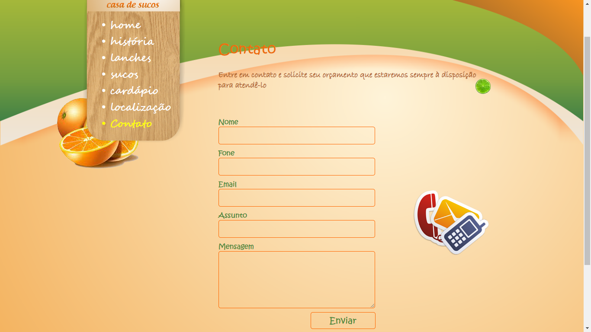
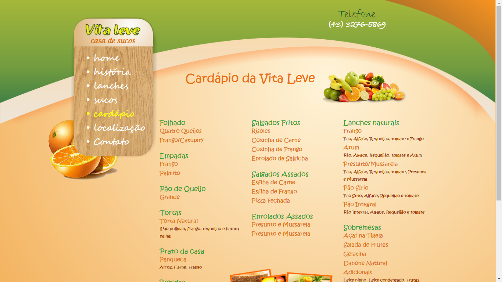

# Site-Vita-Casa-de-Suco

Site feita uma casa de sucos, sem Painel administrativo, programado por mim do zero o front-end e back-end, onde foi de extrema importância o meu aprendizado.
De forma estrutural onde tentava sempre inovar da minha maneira, hoje em dia claro que não é uma boa prática o metodo e a maneira
como foi programado, mas na época foi muito importânte para mim testar novos conhecimentos e o mais importante, ajuando o usuário final.

# Screenshots

      

